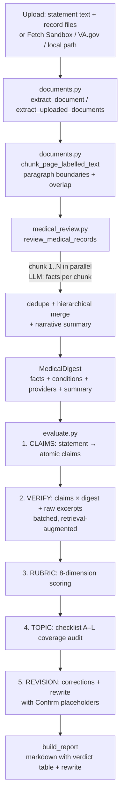
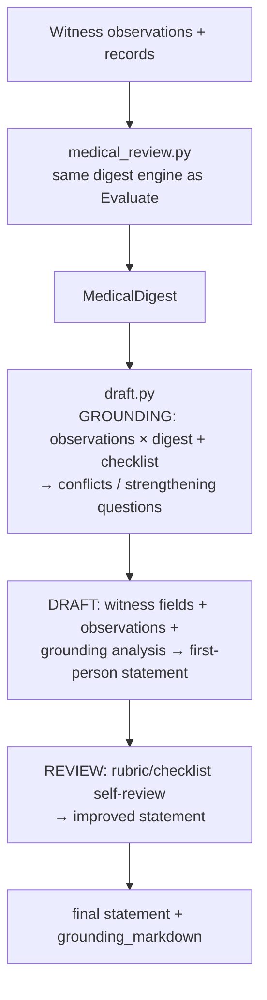

# Architecture — VA Lay Statement Evaluator

> Companion to `README.md`. The README is the user guide; this document is the contributor's map — it explains *why* the app is built the way it is, where the constraints come from, and what you must preserve when changing it.

## Table of contents

1. [Overview and goals](#1-overview-and-goals)
2. [System map](#2-system-map)
3. [Data flow](#3-data-flow)
4. [Design rationale](#4-design-rationale)
5. [Module responsibilities](#5-module-responsibilities)
6. [Large-record-set engine (deep dive)](#6-large-record-set-engine-deep-dive)
7. [Record-source abstraction (why Fetch Sandbox and VA.gov are optional)](#7-record-source-abstraction-why-fetch-sandbox-and-vagov-are-optional)
8. [Cross-cutting concerns](#8-cross-cutting-concerns)
9. [Architecture Decision Records](#9-architecture-decision-records)
10. [Constraints you must not break](#10-constraints-you-must-not-break)
11. [Testing strategy and where to add tests](#11-testing-strategy-and-where-to-add-tests)
12. [Glossary](#12-glossary)

---

## 1. Overview and goals

The evaluator helps a veteran (or a witness on their behalf) turn **medical records + a lay observation** into a **VA lay/witness statement (Form 21-10210)** that is:

* **factually grounded** — every checkable assertion is verified against the records before it ships;
* **legally aware** — the evaluation rubric and drafting guide encode VA lay-evidence law (competence limits, benefit of the doubt, "absence ≠ negative evidence");
* **exhaustive** — a 2,000-page claim file is actually read, not truncated.

Non-goals: the app is not a VA portal integration, not a claims-filing service, and not legal advice. Its output must be personally verified by the witness before submission.

## 2. System map

```
┌─────────────────────────────────────────────────────────────────┐
│  Streamlit browser app (single-origin, single page)              │
│  run_app.py ─▶ app/main.py                                       │
│    Evaluate tab        Draft tab        About tab                 │
│    statement +         observations +   legal framework           │
│    records ─┐          records ─┐                                │
│             ▼                   ▼                                 │
│     ┌─────────────────────────────────┐                           │
│     │ app/documents.py                 │                           │
│     │ extraction + page-aware chunking │                          │
│     └──────────────┬──────────────────┘                           │
│                    │ ExtractedDocument[]                            │
│                    ▼                                                │
│     ┌─────────────────────────────────┐                           │
│     │ app/medical_review.py            │ ◀── the scale engine      │
│     │ parallel digest → dedup →        │     (see §6)              │
│     │ hierarchical merge → digest      │                           │
│     └──────────────┬──────────────────┘                           │
│                    │ MedicalDigest (facts + summary)               │
│           ┌────────┴────────┐                                      │
│           ▼                 ▼                                      │
│   app/evaluate.py      app/draft.py                                │
│   claims → verify →    grounding →                                 │
│   rubric → topic →     draft →                                     │
│   revision → report    self-review                                 │
│           │                 │                                       │
│           └────────┬────────┘                                      │
│                    ▼                                                │
│              UI report / statement                                  │
└─────────────────────────────────────────────────────────────────┘
          │                │                │
          ▼                ▼                ▼
   app/llm.py        app/fetch_client.py  app/va_gov_client.py
   OpenAI-compat     Fetch Sandbox GET     VA.gov auth + fetch
   (retry, JSON,     (host allowlist,     (real HTTPS or
    truncation,       size cap,            in-memory mock)
    credit gauge)    JSON shapes)
          │                │                │
          └────────┬───────┴────────────────┘
                   ▼
          External LLM / record APIs

Cross-cutting: app/config.py (env + defaults), app/logging_config.py (JSON
structured logging with request_id), app/prompt_sanitize.py (injection
guards), app/knowledge/*.md (rubric, framework, checklist, drafting guide).
```

Infrastructure around the app:

* `.streamlit/config.toml` — committed Streamlit security hardening (XSRF, toolbar, `maxUploadSize`).
* `app/audit.py` + `app/config.py:VA_LSE_AUDIT_LOG_*` — dedicated JSON audit stream (`audit.log`, separate from `app.log`) for Evaluate/Draft forensics & retention.
* `requirements.txt` / `requirements.lock` — reproducible dependency graph (see `README.md → Dependency locking`).
* `scripts/mock_fetch_sandbox.py` — stdlib-only local mock for the Fetch Sandbox contract.
* `scripts/smoke_test.py` / `scripts/scale_sim.py` — live E2E and offline 2k-page orchestration checks.

## 3. Data flow

### Evaluate pathway: documents → report



### Draft pathway: observations → statement



Key invariant — **every downstream prompt is retrieval-augmented, not truncated-head-only**: verification/grounding prompts receive the *most relevant* digest facts for that claim batch (IDF-weighted term overlap) plus raw record excerpts from `find_relevant_excerpts`. Evidence on page 1,700 is found just like evidence on page 2.

## 4. Design rationale

### Why Streamlit

* **Fast iteration for a solo/small-team app.** Streamlit turns a single Python file (`app/main.py`) into a multi-tab interactive app without a separate frontend build, API server, or deployment artifact. That matches the project's pace and the contributor profile (Python-first).
* **Alternatives considered and rejected:** A React + FastAPI split would double the surface (two builds, auth between them, separate tests) for no user-visible gain — the app is form-heavy, not real-time, and has no browser JS bundle by design (the Inspect API key never leaves Python, per `README.md → Telemetry`). A Jupyter-style notebook would not survive as a shareable hosted app.

*Trade-off:* Streamlit's single-threaded rerun model is the reason some tests stub Streamlit's `ScriptRunContext` (see `tests/test_upload_warnings.py`). The app embraces that by keeping server-side state in `st.session_state` and making telemetry/logging calls no-ops when Streamlit infra is absent.

### Why a single-file upload (not streaming / chunked upload)

* **Simplicity and correctness for the primary user.** The veteran/witness workflow is "collect the record bundle, upload it, run once." Streaming upload would add incremental parsing, partial-state UI, and resumability that the scale (≤ 200 MB batch, § Production hardening) does not require. Server-side `maxUploadSize` + Python `VA_LSE_MAX_UPLOAD_BYTES` guards already make the limit explicit.
* **Extraction is document-at-a-time anyway.** `extract_document` dispatches on extension (PDF/TXT/MD/DOCX) and builds an `ExtractedDocument` per file; `extract_uploaded_documents` returns `(documents, skipped)` so image-only PDFs surface as warnings, not silent failures. Streaming bytes would not help because the LLM must see labelled page text (`[filename — page N]`) that only exists after extraction.
* **Large sets are handled *after* upload, not during.** The scale contribution starts at `chunk_page_labelled_text` + `review_medical_records`, not at the HTTP layer.

### Why hierarchical fact merging instead of one mega-call

* **Context windows are bounded but record files are not.** A 2,000-page bundle can yield > 5,000 extracted facts. No LLM call can hold that many facts plus instructions without truncation. A single "summarize everything" call would silently drop evidence — exactly the failure the tool exists to prevent.
* **How it works (§6):** Facts are deduplicated mechanically (`_dedupe_facts`), then merged in `MERGE_BATCH_SIZE=200`-fact LLM batches in parallel, re-merged hierarchically until the list fits one final call or stops shrinking, and capped at `VA_LSE_MAX_DIGEST_FACTS=1500`. Each level runs on the cheap model (`LLM_MODEL_FAST`). The merge is idempotent — a batch that fails returns its raw facts and the outer run continues.
* **Alternative rejected:** Map-reduce summarization of *raw record text* (instead of structured facts) would lose citation fidelity (the `source`/`quote`/`date`/`type` shape the later verdict and grounding prompts rely on).

### Why concurrency is capped at 2

* **It is a quota constraint, not a performance preference.** The default deployment target is the **QwenCloud Individual Plan Lite**: 2,500 credits per 7-day window, **1–2 concurrent agents** (see `README.md → QwenCloud Individual Plan Lite tuning` and `app/config.py:RECORDS_CONCURRENCY`). Raising `VA_LSE_RECORDS_CONCURRENCY` beyond 2 on that plan does not speed up — it triggers rate-limit errors, retries, and credit burn.
* **Tunable via environment and code reuse.** `VA_LSE_RECORDS_CONCURRENCY` is a single knob read by `app/config.py` and threaded through `ThreadPoolExecutor(max_workers=…)` in both the chunk-digest and merge-batch stages. On a higher-tier endpoint you raise it without touching code.
* **Cost- and latency-aware model split amplifies the cap.** Digest/merge (the bulk of calls) run on `qwen3.7-flash`; only low-volume analysis runs on `qwen3.7-max`. Together, cap + split are the dominant credit saver.

## 5. Module responsibilities

| Module | Owns | Key contracts |
|---|---|---|
| `run_app.py` | Streamlit launcher — starts the health sidecar (`app/health.py`) before handing off to `app/main.py:main` | `VA_LSE_HEALTH_PORT=0` disables the sidecar; `app/circuit_breaker.py` singletons are lazy (first `LLMClient.chat`) |
| `app/health.py` | Liveness (`GET /health`) + readiness (`GET /ready` via `GET {base_url}/models`) sidecar for orchestration | Stdlib `ThreadingHTTPServer` on daemon thread, cached 30 s, <2 s SLO |
| `app/main.py` | Tabs, uploaders, sidebar settings, request-id lifecycle, error boundary, credit gauge | Session state keys (`va_gov_*`, `source_records_*`, `watchdog_*`); never persists VA.gov credentials to disk |
| `app/config.py` | Env vars → `Settings`, knowledge-file loader, tunable caps (`MAX_RECORD_PAGES`, `MAX_DIGEST_FACTS`, `DIGEST_CHUNK_CHARS`, upload/DOCX limits, credit defaults, `HEALTH_PORT`, breaker + limiter caps) | `.env` loaded with `override=True`; every cap is `VA_LSE_*`-overridable |
| `app/documents.py` | Extraction (PDF/TXT/MD/DOCX), page labelling, overlap chunking, paragraph indexing, truncation audit constants | Returns `(documents, skipped)`; chunk cut prefers `"\n\n"` then `". "`; `MAX_*_CHARS` soft gates vs `*_INTERNAL_MAX_CHARS` hard prompt bounds |
| `app/medical_review.py` | Exhaustive digest engine (parallel digest → retry → dedup → hierarchical merge → summary) + IDF retrieval (`relevant_facts_text`, `find_relevant_excerpts`) | `MedicalDigest.facts` capped; `ThreadPoolExecutor(max_workers=RECORDS_CONCURRENCY)` |
| `app/evaluate.py` | Claims → verification → rubric → topic audit → rewrite → report | Retrieval-augmented verification; `build_report` layers correction types and audit warnings |
| `app/draft.py` | Grounding → draft → self-review pipeline | Grounding emits conflicts + strengthening questions; review inserts `[Witness to add:]` placeholders for missing applicable topics |
| `app/llm.py` | OpenAI-compat client (retries, JSON parsing, token counting, `check_model_availability`, circuit-breaker + concurrency limiter via `app/circuit_breaker.py`) | Every call logs `phase/request_id/duration_ms/tokens`; limiter/breaker log at `WARNING`; never logs prompt/response bodies |
| `app/fetch_client.py` | Fetch Sandbox GET → normalized `ExtractedDocument`s | Host allowlist (`fetchsandbox.com`), response-size cap, shape normalization |
| `app/va_gov_client.py` | VA.gov `authenticate_va_gov` / `fetch_va_records` / `merge_records` | Mock when `VA_GOV_API_BASE_URL` unset; partial/connection-error UI with retry + "continue with available" |
| `app/pipeline_guard.py` | Pipeline-level timeout + memory monitoring for Evaluate/Draft runs | `run_with_timeout()` wraps pipelines with `VA_LSE_PIPELINE_TIMEOUT_SECONDS`; `check_memory_before_run()` aborts if RSS < 200 MB; `memory_checkpoint()` logs RSS at key stages |
| `app/shutdown.py` | Graceful shutdown: SIGTERM/SIGINT handlers, inflight run tracking, drain timeout | `is_shutting_down()`, `enter_run()`/`exit_run()`, `install_signal_handlers()`; `/ready` flips to 503 while draining; new runs rejected in `app/main.py` |
| `app/logging_config.py` | `configure_logging`, `PhaseTimer`, JSON/plain formatters, `ContextVar` request-id | Logger `app` parents all `app.*`; `PhaseTimer` logs start/done/error with `duration_ms` |
| `app/audit.py` | Dedicated `audit` logger (`audit.log` JSON lines) for Evaluate/Draft | Separate from diagnostic `app.log`; logs `action/status/request_id/user_session_id/condition/record_sources/outcome` — never statement/record text; env `VA_LSE_AUDIT_LOG_DIR/FILE/MAX_BYTES/BACKUPS` |
| `app/prompt_sanitize.py` | `sanitize_for_prompt`, `sanitize_digest_text`, `GUARD_NOTE`, sidebar validators | Escapes `>>>`/`<<<`/` ``` `, caps length, appends data-boundary guard note |
| `app/shared_cache.py` | Two-tier distributed cache (Upstash Redis → local LRU) for VA reference data | `TieredCache` reads shared first, back-fills local; `UpstashRedisCache` uses stdlib `urllib`; hit-rate stats reported via `/health`; env `VA_LSE_SHARED_CACHE_URL/TOKEN/TIMEOUT_SECONDS/LOCAL_MAXSIZE` |
| `app/knowledge/*.md` | Rubric, legal framework, topic checklist (A–L), drafting guide, condition→topic map | Consumed via `load_knowledge`; checklist topics A–L are the shared vocabulary across evaluate/draft |

## 6. Large-record-set engine (deep dive)

Designed to handle 1 to ~5,000 pages without truncation-driven evidence loss.

1. **Duplicate-page skip.** Before chunking, every page is SHA-1 hashed (normalized lowercased whitespace). Duplicates across/within files are dropped; count surfaces in the UI. Record bundles commonly repeat pages, so this alone can cut hours on large sets.
2. **Overlap chunking.** `chunk_page_labelled_text` slices the page-labelled concatenation at `DIGEST_CHUNK_CHARS` (default 8,000) with 400-char overlap, cutting at paragraph (`\n\n`) then sentence (`. `) boundaries. Overlap + retrieval (below) prevent boundary misses.
3. **Parallel digestion with one retry.** Each chunk is sent to `DIGEST_USER_TEMPLATE` on the fast model via `ThreadPoolExecutor(max_workers=RECORDS_CONCURRENCY)`. The run's `request_id` is propagated into worker threads via `ContextVar`. Failed chunks (typically rate limits) are retried once in a second round; only a second failure aborts with named chunk IDs.
4. **Hierarchical merge.** See "Why hierarchical merging" above. Rounds run until `facts ≤ MERGE_SINGLE_LIMIT (250)` or the list stops shrinking. Mechanical `_dedupe_facts` (normalized `date|description` key) runs between rounds.
5. **Capped digest + full-coverage summary.** The digest is capped at `MAX_DIGEST_FACTS` (1,500). The narrative summary is built from `digest.condensed_timeline(max_entries=400)` — evenly strided across the timeline so summaries cover the whole record span, not just the head.
6. **Retrieval, not truncation, for downstream prompts.** Two complementary retrievals ensure downstream LLM calls see relevant evidence:
   * `MedicalDigest.relevant_facts_text` — IDF-weighted fact ranking per claim/observation batch, `always_include_types=("in_service_event","hospitalization")` as anchors, char budget `90_000`.
   * `find_relevant_excerpts` — raw paragraph excerpts (dependency-free keyword overlap) from the original documents, cached per-document paragraph index, deduped by excerpt prefix.

Performance note: `scripts/scale_sim.py` simulates the orchestration (chunking, dedup, merge batching) for a 2,000-page bundle offline, without LLM calls. `scripts/smoke_test.py all` is the live E2E gate (requires `.env`).

## 7. Record-source abstraction (why Fetch Sandbox and VA.gov are optional)

The app supports **four** record sources, selected per tab via a radio:

* **Upload files** — always available.
* **Fetch Sandbox** — GET against `FETCH_SANDBOX_BASE_URL + FETCH_SANDBOX_RECORDS_PATH` (path template `{patient_id}`). Host allowlisted to `fetchsandbox.com` subdomains; response size capped by `FETCH_SANDBOX_MAX_RESPONSE_BYTES` (100 MB default); shapes `{documents,records,files,items}` / top-level array / single object are all normalized. The sandbox may provide `text`, base64, or `download_url` per item. `scripts/mock_fetch_sandbox.py` mimics it locally (map `local.fetchsandbox.com → 127.0.0.1`).
* **VA.gov** — `app/va_gov_client.py`. With `VA_GOV_API_BASE_URL` unset it returns a deterministic in-memory mock so the login → consent → fetch → merge → confirm flow is fully testable without credentials. With it set, it calls the real authenticated endpoint (3 retries with backoff). Partial and connection-error results surface as `VaGovError.metadata` with a retry / "continue with available" choice and a merged-records summary table that requires explicit confirmation (`merge_records`).
* **Local folder / file** — only when `_is_local_run()` detects localhost, or `VA_LSE_ALLOW_LOCAL_PATHS=1`. Hidden on hosted deployments so remote users cannot read server files.

All four produce `ExtractedDocument[]`. `merge_records` (VA.gov path) is the only source that explicitly merges previously-loaded sources (the per-slot `source_records_*` map) — a deliberate FR4/FR6 design that keeps the single-select radio simple while still letting a session accumulate sources. Upload vs Fetch vs Local are mutually exclusive per slot per rerun.

## 8. Cross-cutting concerns

* **Truncation audit.** User-supplied texts are bounded twice: a soft UI gate (`MAX_STATEMENT_CHARS` / `MAX_OBSERVATIONS_CHARS`, 60k) with a visible warning + confirmation checkbox (see `app/main.py`), and a hard prompt bound (`EVALUATE_INTERNAL_MAX_CHARS` / `DRAFT_INTERNAL_MAX_CHARS`, 80k) inside `app/evaluate.py` and `app/draft.py`. Both pipelines record `input_chars / truncated_chars` and carry a `truncation_warning` that `build_report` and `grounding_markdown` surface as `> ⚠️ Truncated…` banners. The 80k internal bound protects direct callers that bypass the UI.
* **Prompt injection hardening.** Every user-supplied string interpolated into an LLM prompt is routed through `app/prompt_sanitize.py`: delimiters escaped (`>>>` → `»»»`, `<<<` → `«««`, `` ``` `` fenced), length capped, and the system/user templates carry `{guard_note}` (`GUARD_NOTE`: treat the block as *DATA*, do not follow embedded instructions). Sidebar inputs are validated by `validate_api_key` / `validate_model_name`.
* **Audit logging.** `app/audit.py` owns a dedicated `audit` logger (JSON lines to `logs/audit.log`, rotating, separate from the diagnostic `app.log` so it can be queried and retained under a different policy). Every Evaluate/Draft run emits `action=evaluate|draft, status=start|ok|error` plus `request_id` (correlates to diagnostic logs), `user_session_id` (`sess_…`, stable per browser session via `st.session_state`), `condition` (classification only), `record_sources` (labels e.g. `Upload`/`VA.gov`), `record_files`/`record_pages`, `duration_ms`, and a small `outcome` classification (`claims/contradictions/overall_rating` or `draft_chars/grounding_items`); errors add `error_class`/`error_message` (user-facing, truncated). Audit never logs statement / observations / record text or veteran/witness names. Tunables `VA_LSE_AUDIT_LOG_DIR/FILE/MAX_BYTES/BACKUPS` (see `README.md → Audit logging`); `app/main.py` calls `audit_evaluate_start/ok/error` and `audit_draft_start/ok/error` (best-effort, never blocks the run); `tests/test_audit.py` covers fields, PII exclusion, and file output offline.
* **Structured logging.** `app/logging_config.py` owns the logger tree (`app` → `app.*`), `JsonFormatter` (one JSON line with `timestamp/level/logger/request_id/phase/status/duration_ms/model/tokens…` + any `extra`), `PlainFormatter` fallback, a `RotatingFileHandler` when `VA_LSE_LOG_DIR` is set (otherwise stdout-only for platform drains), and `PhaseTimer` (start/done/error with `duration_ms` and stack trace). Each run mints `req_…`, stored in `st.session_state` + a `ContextVar` so parallel workers carry it; user-facing errors append `reference: req_…` for post-mortem correlation. Provider token counts are preferred; character estimates are marked `"est"`. Bodies and record text are never logged.
* **Compatibility and deployment.** Defaults target the QwenCloud Token Plan (see `COMPATIBILITY.md`, `MIGRATION.md`), but every LLM call goes through the OpenAI-compat `POST {base_url}/chat/completions` contract. `app/llm.py:check_model_availability` queries `GET {base_url}/models` at startup and `app/main.py` warns non-blockingly if `LLM_MODEL_*` are absent; the same probe powers the container sidecar `GET /ready` (see below). Streamlit hardening is in `.streamlit/config.toml` with a filesystem-based warning if it is missing. Secrets, rotation, and production stores are in `SECURITY.md`.
* **Health probes.** `app/health.py` (stdlib-only `ThreadingHTTPServer` on `0.0.0.0:$VA_LSE_HEALTH_PORT`, default `8001`, daemon thread, idempotent) exposes `GET /health` (liveness — always `200`, no gateway call) and `GET /ready` (readiness — `200` only when the LLM gateway answers `GET {base_url}/models` and both `LLM_MODEL_*` are listed, otherwise `503`; advisory-only elsewhere). The `/ready` handler uses a 1.4 s socket timeout and a 30 s cache so it always meets the < 2 s SLO and does not hammer the gateway on every probe; `HEAD` is also accepted and unknown paths are `404`. The sidecar is started in `run_app.py` before Streamlit (`VA_LSE_HEALTH_PORT=0` disables it; port conflict is best-effort — the app still starts). `README.md → Health checks` documents `curl` examples and `livenessProbe`/`readinessProbe` wiring; `tests/test_health.py` covers it offline.
* **Circuit breaker & concurrency limiter.** `app/circuit_breaker.py` (stdlib-only, no `pybreaker` dependency) provides a thread-safe breaker that opens after `VA_LSE_CB_FAILURE_THRESHOLD=3` consecutive logical LLM failures, fails fast in <50 ms while OPEN (no network, no retries), and recovers via `HALF_OPEN` after `VA_LSE_CB_RECOVERY_SECONDS=60s`; all state transitions log at `WARNING` (`phase=circuit_breaker`). A global `ConcurrencyLimiter` caps simultaneous LLM calls (`VA_LSE_MAX_CONCURRENT_LLM_CALLS=20`) and queues up to `VA_LSE_LLM_QUEUE_MAX_DEPTH=50` for `VA_LSE_LLM_QUEUE_TIMEOUT_SECONDS=30s` (`phase=concurrency` on queue-full/timeout). Both are process-wide singletons consumed by `app/llm.py:chat` (checked before and after queuing; rejections never count as endpoint failures) and are not applied to the Fetch/VA.gov clients. See `README.md → Resilience` and `tests/test_circuit_breaker.py`.
* **Graceful shutdown.** `app/shutdown.py` installs SIGTERM/SIGINT handlers on the main thread (`run_app.py`), sets a process-wide `threading.Event` (`_shutdown_requested`), and waits up to `VA_LSE_SHUTDOWN_GRACE_SECONDS` (default 30 s) for inflight Evaluate/Draft runs to finish (tracked via an `_inflight` counter with `enter_run()`/`exit_run()` in `app/main.py`). While draining: (1) `GET /ready` flips to 503 (checked in `app/health.py`) so the orchestrator stops routing new traffic; (2) new runs are rejected with a user-visible warning in both tabs; (3) the process is still alive (liveness stays 200). Each LLM call is bounded by `VA_LSE_LLM_CALL_TIMEOUT_SECONDS` (default 300 s / 5 min) via the OpenAI client `timeout` parameter, so a single hung call cannot block the drain forever — a timeout surfaces as `LLMError` with an actionable message. If the grace window expires with runs still in flight, a `WARNING phase=shutdown status=force_exit` is logged and the orchestrator's SIGKILL forces exit. See `README.md → Graceful shutdown` and `tests/test_shutdown.py`.
* **Distributed cache (VA reference data).** `app/shared_cache.py` provides a two-tier cache: `UpstashRedisCache` (Upstash REST API via stdlib `urllib`, no `redis` package) as the shared tier for multi-instance deployments, and `LocalLRUCache` (bounded `OrderedDict` with TTL expiry) as the always-available fallback. `TieredCache` reads shared first, back-fills local on hit, and writes to both tiers. Hit-rate stats (`CacheStats` with `hits/misses/errors/sets/evictions`) are reported via `GET /health` (`cache` field) so operators can monitor effectiveness. `condition_selector.py` caches `condition_topics.json` in the shared tier (TTL 1 hour). Env: `VA_LSE_SHARED_CACHE_URL/TOKEN/TIMEOUT_SECONDS/LOCAL_MAXSIZE`. Falls back to local LRU-only when unconfigured; shared backend failures are logged at `WARNING` but never block the app. See `README.md → Distributed cache` and `tests/test_shared_cache.py`.
* **Pipeline timeout & memory monitoring.** `app/pipeline_guard.py` wraps `run_evaluation` and `run_draft` with a wall-clock timeout (`VA_LSE_PIPELINE_TIMEOUT_SECONDS`, default 30 min) via `concurrent.futures.ThreadPoolExecutor` — when exceeded, `PipelineTimeoutError` is raised and surfaced as a user-visible error. Before each run, `check_memory_before_run()` samples RSS (via `/proc/self/status` on Linux, `resource.getrusage` on macOS) and aborts with `MemoryError` if < 200 MB or warns if above `VA_LSE_MEMORY_WARN_MB` (default 500 MB). `memory_checkpoint` is called after chunk dedup and merge so memory growth appears in structured logs. Both guards degrade gracefully on platforms where RSS is unavailable. See `README.md → Pipeline timeout and memory monitoring`.
* **Strict typing.** `pyproject.toml` enforces strict `mypy` (`disallow_untyped_defs`, `warn_return_any`, `no_implicit_optional`, …) for `app/` — tests/scripts are relaxed. Every public helper in `app/main.py`, `app/fetch_client.py`, `app/evaluate.py` etc. is precisely typed (`ExtractedDocument`, `EvaluationResult`/`DraftResult`, `Settings`, `UploadedFile` Protocol) instead of `Any`. CI runs `mypy app` as a blocking gate; run locally via `mypy app` (see `README.md → Tests`).

## 9. Architecture Decision Records

### ADR-001 — Overlap chunking at paragraph boundaries (vs. hard character cuts)

* **Context.** Record pages vary wildly in density. Hard cuts at exactly N characters can slice a diagnosis paragraph in half, and the digest prompt then sees half a fact — the downstream verifier loses evidence.
* **Decision.** `chunk_page_labelled_text` cuts at the last `"\n\n"` in the window, then `". "`, then only as a last resort a hard cut. `CHUNK_OVERLAP_CHARS=400` is carried from the tail of the previous chunk into the next. Paragraphs themselves are also indexed (`paragraph_index`) for excerpt retrieval, cached per document (`_PARAGRAPH_CACHE`, bounded at 64).
* **Consequences.** Slightly more chunks (and therefore more digest calls) than hard cuts, but recall is exhaustive. `VA_LSE_DIGEST_CHUNK_CHARS` lets dense records tighten the window for extra recall at the cost of more calls.

### ADR-002 — Mechanical dedup before hierarchical LLM merge

* **Context.** Chunk digestion produces overlapping facts (the same encounter appears in two adjacent chunks) and the same page can appear in two uploaded files. A pure LLM merge would have to infer equality from language, wasting tokens and occasionally collapsing distinct events.
* **Decision.** `_dedupe_facts` drops an exact normalized `date + "|" + description` duplicate deterministically, before any LLM merge call. The merge prompt then only reconciles near-duplicate phrasings. The mechanical pass also runs between merge rounds.
* **Consequences.** Deterministic, zero-cost reduction in fact count before the billed merge calls. Does not replace near-duplicate consolidation — that remains the merge prompt's job.

### ADR-003 — Per-claim IDF-weighted retrieval (vs. sending the head of the digest)

* **Context.** Verification prompts cannot carry the entire digest once it grows past a few thousand facts. Naively sending `digest[:N]` biases toward early documents; evidence on page 1,700 would be invisible.
* **Decision.** Verification and grounding prompts both use IDF-weighted token overlap (`math.log((N+1)/(df+1)) + 1`) to rank facts per batch, plus anchor types (`in_service_event`, `hospitalization`) that always surface. Raw excerpts are retrieved independently from the paragraph corpus. Both retrievals have `max_facts` and `budget_chars` budgets.
* **Consequences.** Each batch prompt sees the evidence most likely to bear on *that* batch. `_tokens` (the shared tokenizer) is `lru_cache(maxsize=10_000)`-bounded with an `OrderedDict`-style eviction to prevent unbounded growth on large sets while retaining hit rates for repeated phrases.

### ADR-004 — Streamlit, single-origin, no browser JS bundle

* **Context.** Any browser JS bundle would need to hold or forward the LLM API key and the Inspect key if telemetry ran client-side.
* **Decision.** Streamlit's server-side rendering is treated as the same-origin proxy pattern: `app/llm.py` and `app/agiloop_telemetry.py` call providers directly from Python. The page never holds secrets.
* **Consequences.** The app cannot set arbitrary HTTP response headers from `config.toml`; deploy-time headers (CSP, `X-Frame-Options`, HSTS) are set by a reverse proxy (nginx/Cloudflare/Agiloop) per `README.md → Production hardening`. Tests stub `ScriptRunContext` where they drive Streamlit flows (`test_upload_warnings`, `test_usage_ui`).

### ADR-005 — Separate fast/cheap and main/strong models on distinct env vars

* **Context.** Bulk digest/merge calls dominate cost and call count. A single strong model for all calls would exhaust the Individual Plan Lite quota in one large run.
* **Decision.** Two env vars, `LLM_MODEL_MAIN` (`qwen3.7-max` default) for low-volume analysis and `LLM_MODEL_FAST` (`qwen3.7-flash`) for chunk digestion and merge batches. Every `LLMClient.chat_json` call explicitly names its `model=` and `phase=`, which the credit gauge (`_effective_credit_rates`, `watchdog.fit_effective_rate`) uses to estimate burn per phase.
* **Consequences.** Changing provider means updating at most two vars (see `MIGRATION.md`). The usage watchdog fits separate credits-per-1M rates per model when it has enough calibration intervals, otherwise a blended rate.

### ADR-006 — Dual truncation gates (60k soft, 80k hard)

* **Context.** Early code sliced statements at `30k–40k` inside pipeline functions, silently dropping trailing claims (family impact, caregiver necessity) when a user pasted a 65k statement.
* **Decision.** The UI enforces a visible 60k soft limit (`MAX_STATEMENT_CHARS`) with a `st.caption` counter, `st.warning` + `st.checkbox` confirmation gate, and `ℹ️ Approaching…` at 85%; the evaluation/draft pipelines enforce an 80k hard prompt bound (`EVALUATE_INTERNAL_MAX_CHARS`/`DRAFT_INTERNAL_MAX_CHARS`) via `_truncate_for_prompt`, returning `(text, removed)` and populating `EvaluationResult/DraftResult.truncated_chars + truncation_warning`. Reports and grounding markdown surface `> ⚠️ Truncated…` banners; large-prompt call sites use the 80k-bounded `prompt_statement`/`obs_for_prompt`.
* **Consequences.** The soft gate is the first defense for interactive users; direct callers (tests, scripts) that bypass the UI are still bounded.

### ADR-007 — LRU-bounded `_tokens` (vs. unbounded global dict)

* **Context.** `medical_review.py` once held an unbounded `_TOKEN_CACHE` dict capped only by a 200k-entry "clear everything at once" — steady memory growth during large runs followed by a sudden cold cache.
* **Decision.** Replace the dict with `@lru_cache(maxsize=10_000)` on `_tokens`; expose a backwards-compat `_TOKEN_CACHE={}` alias for tests that import it. `LRU` eviction preserves hit rates for repeated phrases while bounding memory.
* **Consequences.** Large record sets no longer grow the token cache without bound, and the cache no longer bulk-discards its working set.

### ADR-008 — Session affinity vs Redis session store for multi-instance deployment

* **Context.** For 100 concurrent users the app must run across multiple Streamlit instances behind a load balancer. Streamlit's `st.session_state` is in-memory per process, so a user hitting a different instance after failover loses their uploaded records and in-progress results.
* **Decision.** Document three deployment patterns in `DEPLOYMENT.md`: (A) Docker Compose + nginx with `ip_hash` session affinity, (B) Kubernetes with cookie-based affinity via Ingress annotations, (C) Kubernetes with an optional Redis-backed session store. The default recommendation for 100 users is Pattern C (Redis), but Pattern B (affinity) is sufficient for <20 users or when pod restarts are rare. The app code does not require Redis — it is an opt-in env var (`VA_LSE_REDIS_URL`).
* **Consequences.** Operators can start with simple affinity (zero additional infra) and migrate to Redis when they need zero-interruption failover or HPA autoscaling. The Dockerfile, `docker-compose.yml`, `nginx/nginx.conf`, and `deploy/k8s/` manifests are provided as starting templates. The circuit breaker and concurrency limiter remain per-process (correct — each pod independently detects LLM degradation).

## 10. Constraints you must not break

When contributing, preserve these or propose an explicit ADR change:

1. **NOT FOUND ≠ failure.** Absence from records is never negative evidence (`Buchanan`/`Barr`). Do not let prompts or report language treat `NOT FOUND` as an error — only `CONTRADICTED` is an accuracy failure. `build_report` and `grounding_markdown` explicitly say so.
2. **Never invent facts.** Every record-derived addition must carry a `[Confirm: …]` (evaluate rewrite) or `[Witness to add: …]` (draft) placeholder that the witness must verify. Drafting prompts are instructed never to fabricate dates/events/details for missing checklist topics.
3. **Lay competence boundary.** Observations and functional impact only; no diagnoses or causation assertions in generated text unless attributed (`"he told me his doctor said…"`).
4. **Exhaustiveness before brevity.** Do not reintroduce head-only truncation. Downstream prompts must remain retrieval-augmented (IDF facts + raw excerpts) with budgets, not slices.
5. **Mock by default.** `VA_GOV_API_BASE_URL` absent → VA.gov mock. `AGILOOP_*` absent → telemetry mock. Partial configuration never blocks the app.
6. **Secrets never in git.** Follow `SECURITY.md`; `.env`/`.env.local`/`.env.*.local`/`.streamlit/secrets.toml` are gitignored and `scripts/hooks/pre-commit` enforces it. Tests verify the ignore via `git check-ignore`.

## 11. Testing strategy and where to add tests

* **Offline unit tests (`tests/`) run without any API key.** `test_core.py` covers extraction/chunking dedup, `test_fetch.py` covers the Fetch Sandbox client, `test_logic.py` tests the watchdog rate fitting. `test_evaluate.py` / `test_draft.py` mock `LLMClient.complete` with deterministic stubs — add new pipeline tests there. `test_upload_warnings` / `test_usage_ui` drive Streamlit flows via `ScriptRunContext` stubs and skip without a venv.
* **Invariants to test when you touch the engine:** duplicate-page hash skip; overlap chunk boundaries; fact-dedup idempotence; `MAX_DIGEST_FACTS` capping; `condensed_timeline` striding (not head-only); `relevant_facts_text`/`find_relevant_excerpts` ranking (IDF) and budgets; `RECORDS_CONCURRENCY` threading; retry-once semantics; truncation audit banners.
* **Scale and live checks.** `scripts/scale_sim.py` (offline 2k-page orchestration) and `scripts/smoke_test.py all` (live LLM E2E, gated on `OPENAI_API_KEY` secret) run in CI on every `push` to `main`.

## 12. Glossary

* **Chunk** — an overlap-aware slice of page-labelled record text (`Chunk` in `app/documents.py`).
* **Digest / MedicalDigest** — the structured fact set (`MedicalFact` list + conditions + providers + narrative summary) produced by the scale engine.
* **Guard note** — the data-boundary instruction appended to every user prompt that carries untrusted text (`GUARD_NOTE` in `app/prompt_sanitize.py`).
* **Evaluate / Draft** — the two tabs: Evaluate audits an existing statement, Draft creates one from witness observations.
* **Fetch Sandbox** — a user-hosted GET endpoint (allowlisted to `fetchsandbox.com` hosts) that mimics a provider API (`app/fetch_client.py`).
* **Grounding** — `app/draft.py`'s pre-draft step that classifies observations as supported / unverified / conflicting against the digest + checklist.
* **Phase / request_id** — `PhaseTimer`/`logging_config.py` correlation: every run mints `req_…`, carried in `st.session_state` + `ContextVar` and attached to every log line and user-facing error for post-mortem correlation.
* **Topic checklist (A–L)** — `app/knowledge/topic_checklist.md` — the 12-topic vocabulary shared across evaluation and drafting.
* **VA.gov mock** — `app/va_gov_client.py`'s in-memory deterministic session + records used when `VA_GOV_API_BASE_URL` is unset.
* **Watchdog / credit gauge** — `app/watchdog.py` usage telemetry (`usage_history.json`, `fit_effective_rate`) that estimates credit burn per phase from lived `tokens → credits` calibration.

