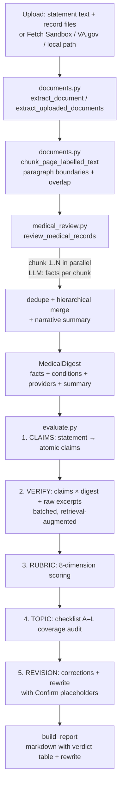
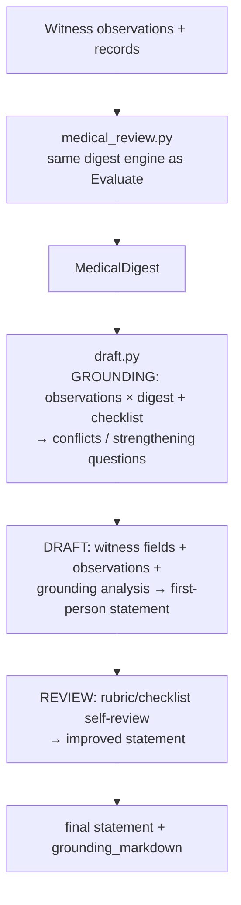

# Architecture — VA Lay Statement Evaluator

> Companion to `README.md`. The README is the user guide; this document is the contributor's map — it explains *why* the app is built the way it is, where the constraints come from, and what you must preserve when changing it.

## Table of contents

1. [Overview and goals](#1-overview-and-goals)
2. [System map](#2-system-map)
3. [Data flow](#3-data-flow)
4. [Design rationale](#4-design-rationale)
5. [Module responsibilities](#5-module-responsibilities)
6. [Large-record-set engine (deep dive)](#6-large-record-set-engine-deep-dive)
7. [Record-source abstraction (why Fetch Sandbox and VA.gov are optional)](#7-record-source-abstraction-why-fetch-sandbox-and-vagov-are-optional)
8. [Cross-cutting concerns](#8-cross-cutting-concerns)
9. [Architecture Decision Records](#9-architecture-decision-records)
10. [Constraints you must not break](#10-constraints-you-must-not-break)
11. [Testing strategy and where to add tests](#11-testing-strategy-and-where-to-add-tests)
12. [Glossary](#12-glossary)

---

## 1. Overview and goals

The evaluator helps a veteran (or a witness on their behalf) turn **medical records + a lay observation** into a **VA lay/witness statement (Form 21-10210)** that is:

* **factually grounded** — every checkable assertion is verified against the records before it ships;
* **legally aware** — the evaluation rubric and drafting guide encode VA lay-evidence law (competence limits, benefit of the doubt, "absence ≠ negative evidence");
* **exhaustive** — a 2,000-page claim file is actually read, not truncated.

Non-goals: the app is not a VA portal integration, not a claims-filing service, and not legal advice. Its output must be personally verified by the witness before submission.

## 2. System map

```
┌─────────────────────────────────────────────────────────────────┐
│  Streamlit browser app (single-origin, single page)              │
│  run_app.py ─▶ app/main.py                                       │
│    Evaluate tab        Draft tab        About tab                 │
│    statement +         observations +   legal framework           │
│    records ─┐          records ─┐                                │
│             ▼                   ▼                                 │
│     ┌─────────────────────────────────┐                           │
│     │ app/documents.py                 │                           │
│     │ extraction + page-aware chunking │                          │
│     └──────────────┬──────────────────┘                           │
│                    │ ExtractedDocument[]                            │
│                    ▼                                                │
│     ┌─────────────────────────────────┐                           │
│     │ app/medical_review.py            │ ◀── the scale engine      │
│     │ parallel digest → dedup →        │     (see §6)              │
│     │ hierarchical merge → digest      │                           │
│     └──────────────┬──────────────────┘                           │
│                    │ MedicalDigest (facts + summary)               │
│           ┌────────┴────────┐                                      │
│           ▼                 ▼                                      │
│   app/evaluate.py      app/draft.py                                │
│   claims → verify →    grounding →                                 │
│   rubric → topic →     draft →                                     │
│   revision → report    self-review                                 │
│           │                 │                                       │
│           └────────┬────────┘                                      │
│                    ▼                                                │
│              UI report / statement                                  │
└─────────────────────────────────────────────────────────────────┘
          │                │                │
          ▼                ▼                ▼
   app/llm.py        app/fetch_client.py  app/va_gov_client.py
   OpenAI-compat     Fetch Sandbox GET     VA.gov auth + fetch
   (retry, JSON,     (host allowlist,     (real HTTPS or
    truncation,       size cap,            in-memory mock)
    credit gauge)    JSON shapes)
          │                │                │
          └────────┬───────┴────────────────┘
                   ▼
          External LLM / record APIs

Cross-cutting: app/config.py (env + defaults), app/logging_config.py (JSON
structured logging with request_id), app/prompt_sanitize.py (injection
guards), app/knowledge/*.md (rubric, framework, checklist, drafting guide).
```

Infrastructure around the app:

* `.streamlit/config.toml` — committed Streamlit security hardening (XSRF, toolbar, `maxUploadSize`).
* `app/audit.py` + `app/config.py:VA_LSE_AUDIT_LOG_*` — dedicated JSON audit stream (`audit.log`, separate from `app.log`) for Evaluate/Draft forensics & retention.
* `requirements.txt` / `requirements.lock` — reproducible dependency graph (see `README.md → Dependency locking`).
* `scripts/mock_fetch_sandbox.py` — stdlib-only local mock for the Fetch Sandbox contract.
* `scripts/smoke_test.py` / `scripts/scale_sim.py` — live E2E and offline 2k-page orchestration checks.

## 3. Data flow

### Evaluate pathway: documents → report



### Draft pathway: observations → statement



Key invariant — **every downstream prompt is retrieval-augmented, not truncated-head-only**: verification/grounding prompts receive the *most relevant* digest facts for that claim batch (IDF-weighted term overlap) plus raw record excerpts from `find_relevant_excerpts`. Evidence on page 1,700 is found just like evidence on page 2.

## 4. Design rationale

### Why Streamlit

* **Fast iteration for a solo/small-team app.** Streamlit turns a single Python file (`app/main.py`) into a multi-tab interactive app without a separate frontend build, API server, or deployment artifact. That matches the project's pace and the contributor profile (Python-first).
* **Alternatives considered and rejected:** A React + FastAPI split would double the surface (two builds, auth between them, separate tests) for no user-visible gain — the app is form-heavy, not real-time, and has no browser JS bundle by design (the Inspect API key never leaves Python, per `README.md → Telemetry`). A Jupyter-style notebook would not survive as a shareable hosted app.

*Trade-off:* Streamlit's single-threaded rerun model is the reason some tests stub Streamlit's `ScriptRunContext` (see `tests/test_upload_warnings.py`). The app embraces that by keeping server-side state in `st.session_state` and making telemetry/logging calls no-ops when Streamlit infra is absent.

### Why a single-file upload (not streaming / chunked upload)

* **Simplicity and correctness for the primary user.** The veteran/witness workflow is "collect the record bundle, upload it, run once." Streaming upload would add incremental parsing, partial-state UI, and resumability that the scale (≤ 200 MB batch, § Production hardening) does not require. Server-side `maxUploadSize` + Python `VA_LSE_MAX_UPLOAD_BYTES` guards already make the limit explicit.
* **Extraction is document-at-a-time anyway.** `extract_document` dispatches on extension (PDF/TXT/MD/DOCX) and builds an `ExtractedDocument` per file; `extract_uploaded_documents` returns `(documents, skipped)` so image-only PDFs surface as warnings, not silent failures. Streaming bytes would not help because the LLM must see labelled page text (`[filename — page N]`) that only exists after extraction.
* **Large sets are handled *after* upload, not during.** The scale contribution starts at `chunk_page_labelled_text` + `review_medical_records`, not at the HTTP layer.

### Why hierarchical fact merging instead of one mega-call

* **Context windows are bounded but record files are not.** A 2,000-page bundle can yield > 5,000 extracted facts. No LLM call can hold that many facts plus instructions without truncation. A single "summarize everything" call would silently drop evidence — exactly the failure the tool exists to prevent.
* **How it works (§6):** `MedicalDigest.facts` retains the complete extracted evidence, removing only exact repetitions including provenance. A separate temporary view is deduplicated mechanically (`_dedupe_facts`) and merged in `MERGE_BATCH_SIZE=200`-fact LLM batches on the cheap model (`LLM_MODEL_FAST`). This view supplies the narrative summary, never retrieval or persistence. A failed merge batch falls back to its input facts. `VA_LSE_MAX_DIGEST_FACTS=1500` limits prompt selection, not storage.
* **Alternative rejected:** Map-reduce summarization of *raw record text* (instead of structured facts) would lose citation fidelity (the `source`/`quote`/`date`/`type` shape the later verdict and grounding prompts rely on).

### Why concurrency is capped at 2

* **It is a quota constraint, not a performance preference.** The default deployment target is the **QwenCloud Individual Plan Lite**: 2,500 credits per 7-day window, **1–2 concurrent agents** (see `README.md → QwenCloud Individual Plan Lite tuning` and `app/config.py:RECORDS_CONCURRENCY`). Raising `VA_LSE_RECORDS_CONCURRENCY` beyond 2 on that plan does not speed up — it triggers rate-limit errors, retries, and credit burn.
* **Tunable via environment and code reuse.** `VA_LSE_RECORDS_CONCURRENCY` is a single knob read by `app/config.py` and threaded through `ThreadPoolExecutor(max_workers=…)` in both the chunk-digest and merge-batch stages. On a higher-tier endpoint you raise it without touching code.
* **Cost- and latency-aware model split amplifies the cap.** Digest/merge (the bulk of calls) run on `qwen3.7-flash`; only low-volume analysis runs on `qwen3.7-max`. Together, cap + split are the dominant credit saver.

## 5. Module responsibilities

| Module | Owns | Key contracts |
|---|---|---|
| `run_app.py` | Streamlit launcher — starts the health sidecar (`app/health.py`) before handing off to `app/main.py:main` | `VA_LSE_HEALTH_PORT=0` disables the sidecar; `app/circuit_breaker.py` singletons are lazy (first `LLMClient.chat`) |
| `app/health.py` | Liveness (`GET /health`), readiness (`GET /ready` via `GET {base_url}/models`) and Prometheus metrics (`GET /metrics`) sidecar for orchestration | Stdlib `ThreadingHTTPServer` on daemon thread, cached 30 s, <2 s SLO; no route performs network I/O without `?probe=1` (ADR-011) |
| `app/main.py` | Thin router — logging/audit setup, config-hardening check, tab wiring, root error boundary | Delegates all rendering to `app/views/*`; session state keys (`va_gov_*`, `source_records_*`, `watchdog_*`) live in the views; never persists VA.gov credentials to disk |
| `app/views/` | View layer extracted from the former monolithic `main.py`: `shared.py` (correlation ids, uploads, record sources, usage watchdog, progress widgets, audit meta), `sidebar.py` (settings + credit widget), `evaluate_view.py`, `draft_view.py`, `about_view.py` | Each tab module exports `render_*_tab`; run orchestration (audit/log/error mapping, shutdown gates, watchdog recording) stays with the view that started the run |
| `app/config.py` | Env vars → `Settings`, knowledge-file loader, tunable caps (`MAX_RECORD_PAGES`, `MAX_DIGEST_FACTS`, `DIGEST_CHUNK_CHARS`, upload/DOCX limits, credit defaults, `HEALTH_PORT`, breaker + limiter caps) | `.env` loaded with `override=True`; every cap is `VA_LSE_*`-overridable |
| `app/documents.py` | Extraction (PDF/TXT/MD/DOCX), page labelling, block splitting for page-less sources, overlap chunking, paragraph indexing, running header/footer stripping, truncation audit constants | Returns `(documents, skipped)`; pages with no text are tracked as `unreadable_pages` rather than dropped silently; password-protected PDFs raise `ExtractionError`, never `FileNotDecryptedError`; chunk cut prefers `"\n\n"` then `". "`; `MAX_*_CHARS` soft gates vs `*_INTERNAL_MAX_CHARS` hard prompt bounds |
| `app/medical_review.py` | Exhaustive digest engine (parallel digest → retry → dedup → hierarchical merge → summary) + IDF retrieval (`relevant_facts_text`, `retrieve_evidence`/`find_relevant_excerpts`) + coverage and citation-check reporting | `MedicalDigest.facts` retains all extracted evidence; merging produces a separate summary view; `ThreadPoolExecutor(max_workers=RECORDS_CONCURRENCY)`; every fact carries `document`/`page`/`section` |
| `app/evaluate.py` | Claims → verification → rubric → topic audit → rewrite → report | Retrieval-augmented verification; `build_report` layers correction types and audit warnings |
| `app/draft.py` | Grounding → draft → self-review pipeline | Grounding emits conflicts + strengthening questions; review inserts `[Witness to add:]` placeholders for missing applicable topics |
| `app/llm.py` | OpenAI-compat client (retries, JSON parsing, token counting, `check_model_availability`, circuit-breaker + concurrency limiter via `app/circuit_breaker.py`) plus **optional failover to a second endpoint** (`OPENAI_BASE_URL_FALLBACK`): `_endpoint_candidates` picks the endpoint per call, `failover_status` reports the state, and the model *role* is translated onto the fallback's names (`_resolve_model`) | Every call logs `phase/request_id/endpoint/duration_ms/tokens`; limiter/breaker log at `WARNING`; a failover logs at `WARNING` and is stamped into the run's usage so the audit record carries `llm_endpoints`; never logs prompt/response bodies |
| `app/fetch_client.py` | Fetch Sandbox GET → normalized `ExtractedDocument`s | Host allowlist (`fetchsandbox.com`), response-size cap, shape normalization |
| `app/va_gov_client.py` | VA.gov `authenticate_va_gov` / `fetch_va_records` / `merge_records` | Mock when `VA_GOV_API_BASE_URL` unset; partial/connection-error UI with retry + "continue with available" |
| `app/pipeline_guard.py` | Pipeline-level timeout + memory monitoring for Evaluate/Draft runs | `run_with_timeout()` wraps pipelines with `VA_LSE_PIPELINE_TIMEOUT_SECONDS`; `check_memory_before_run()` aborts if RSS < 200 MB; `memory_checkpoint()` logs RSS at key stages |
| `app/shutdown.py` | Graceful shutdown: SIGTERM/SIGINT handlers, inflight run tracking, drain timeout | `is_shutting_down()`, `enter_run()`/`exit_run()`, `install_signal_handlers()`; `/ready` flips to 503 while draining; new runs rejected in `app/main.py` |
| `app/logging_config.py` | `configure_logging`, `PhaseTimer`, JSON/plain formatters, `ContextVar` request-id | Logger `app` parents all `app.*`; `PhaseTimer` logs start/done/error with `duration_ms` |
| `app/audit.py` | Dedicated `audit` logger (`audit.log` JSON lines) for Evaluate/Draft | Separate from diagnostic `app.log`; logs `action/status/request_id/user_session_id/condition/record_sources/outcome` — never statement/record text; env `VA_LSE_AUDIT_LOG_DIR/FILE/MAX_BYTES/BACKUPS`; counts handler-level write failures (a full disk used to stop auditing silently) and exposes them via `/health` (`audit`); `error_message` is the one field outside the no-PII contract — scrubbed by default, omittable with `VA_LSE_AUDIT_ERROR_MESSAGES=0` |
| `app/audit_backup.py` | Audit retention + off-pod backup (destinations, byte-range watermarks, state file, health) | `filesystem`/`s3`/`gcs`/`azure` (SDKs lazy, optional); ships rotated files *and* the un-shipped tail of the live `audit.log` cut to the last complete newline; content+range-addressed object keys make an upload-then-crash retry an overwrite, not a duplicate; rotation detected by inode change **or** size regression; state file (not memory) is shared with `/health`; cross-process `BackupLock`; `/health` → `audit_backup` (ADR-010) |
| `app/prompt_sanitize.py` | `sanitize_for_prompt`, `sanitize_digest_text`, `GUARD_NOTE`, sidebar validators | Escapes `>>>`/`<<<`/` ``` `, caps length, appends data-boundary guard note |
| `app/shared_cache.py` | Two-tier distributed cache (Upstash Redis → local LRU) for VA reference data | `TieredCache` reads shared first, back-fills local; `UpstashRedisCache` uses stdlib `urllib`; hit-rate stats reported via `/health`; env `VA_LSE_SHARED_CACHE_URL/TOKEN/TIMEOUT_SECONDS/LOCAL_MAXSIZE` |
| `app/job_queue.py` | Distributed job queue that moves runs off the web pod (Pattern C) | `build_job_backend()` selects Redis (`VA_LSE_REDIS_URL`, redis-py, lazy import) → Upstash REST (reuses shared-cache credentials, stdlib) → `InProcessJobBackend`; `requeue`/`requeue_stale` recover jobs whose worker lease (`JOB_QUEUE_LEASE_SECONDS`) expired; queue depth + backend reported via `/health` (`job_queue`) |
| `app/job_payload.py` | Job payload + result (de)serialization (`ExtractedDocument`/`MedicalDigest`/`EvaluationResult`/`DraftResult`/`UsageTracker` ↔ JSON) | Size-checked against `JOB_QUEUE_MAX_PAYLOAD_BYTES`; every read path coerces and tolerates missing/forward-versioned fields so a corrupt value surfaces as a clear error, never an `AttributeError` in the results panel |
| `app/worker.py` | Worker process (`python -m app.worker`) that executes queued runs | Claims → decodes → `run_with_timeout` under the same memory/timeout guards → stores result; registers each job with `app/shutdown` so SIGTERM drains; emits the audit `start`/`ok`/`error` pair (the submit path deliberately does not) and writes `run_log` events keyed by the same `req_…` reference; `--once`/`--drain-stale`/`--max-jobs` for canaries |
| `app/views/job_runner.py` | Web-pod half of Pattern C: submit, poll, hydrate, resume | `queue_mode_active()` gates the whole path (off ⇒ byte-for-byte the old in-process flow); refuses to queue when the worker has no env API key; `resume_pending_job()` re-attaches to a run started before a reload instead of re-submitting it |
| `app/tracing.py` | Opt-in OpenTelemetry facade: run/phase spans, thread-parent re-attachment, W3C context propagation across the queue, export flush | No-op when `VA_LSE_TRACING` is off or the OTel packages are absent; OTLP over HTTP via standard `OTEL_*` vars; free-text attributes dropped by construction; `/health` → `tracing` (ADR-009) |
| `app/audit_restore.py` | Read the audit backup back: integrity verification, gap analysis, reconstruction | Every object key already ends in the SHA-256 of its own content, so integrity checking needs no side manifest; live windows are grouped by the generation tag in their key (every rotation restarts at offset 0, so without it two files are indistinguishable) and walked for holes, reporting exact missing offsets; `restore_backup` writes `restored.jsonl` + `rotated/` + `manifest.json` and never writes to the destination; `/health` → `restore` (ADR-011) |
| `app/metrics.py` | Prometheus text exposition over the `/health` payload | Pure renderer — no I/O, so a scrape cannot block on a slow dependency; a value that could not be read is omitted rather than zeroed; `GET /metrics` on the health sidecar (ADR-011) |
| `app/blob_store.py` | Storage for job documents too large to queue (Pattern C) | `filesystem` (shared volume; `is_shared`) or `s3` (boto3 from `requirements-s3.txt`, not in the lockfile); content-addressed keys, delete on terminal jobs, sweep past the queue TTL; a reference with no store is a hard `PayloadError`, never an empty run |
| `app/profiler.py` | Lightweight production profiler (phase-level timing, worker stats, p50/p95/p99 aggregation) | Gated by `VA_LSE_PROFILE_RUNS=1`; `phase_timer`/`worker_timer` context managers wrap pipeline phases and parallel workers; `RunProfiler` accumulates per-run data, `Profiler` aggregates across runs; `emit_summary()` logs to `phase=profiler` | |
| `app/knowledge/*.md` | Rubric, legal framework, topic checklist (A–L), drafting guide, condition→topic map | Consumed via `load_knowledge`; checklist topics A–L are the shared vocabulary across evaluate/draft |

## 6. Large-record-set engine (deep dive)

Designed to handle 1 to ~5,000 pages without truncation-driven evidence loss.

1. **Duplicate-page skip.** Before chunking, every page is fingerprinted by content (page-number-only lines dropped, whitespace normalized) *and* compared by word n-gram overlap within a similar-length bucket, so a page re-printed with a different footer or scanned twice is recognised as the same page — the repeats in real bundles are rarely byte-equal. Every skip is recorded with the page it duplicated and named in the coverage report. Record bundles commonly repeat pages, so this alone can cut hours on large sets.
2. **Overlap chunking with page spans.** `chunk_page_labelled_text` slices the page-labelled concatenation at `DIGEST_CHUNK_CHARS` (default 8,000) with 400-char overlap, cutting at paragraph (`\n\n`) then sentence (`. `) boundaries, and parses the `[file — page N]` markers inside each chunk to record the pages it covers. Overlap + retrieval (below) prevent boundary misses.
3. **Parallel digestion with one retry.** Each chunk is sent to `DIGEST_USER_TEMPLATE` on the fast model via `ThreadPoolExecutor(max_workers=RECORDS_CONCURRENCY)`. The run's `request_id` is propagated into worker threads via `ContextVar`. Failed chunks (typically rate limits) are retried once in a second round; only a second failure aborts with named chunk IDs.
4. **Hierarchical merge.** See "Why hierarchical merging" above. Rounds run until `facts ≤ MERGE_SINGLE_LIMIT (250)` or the list stops shrinking. Mechanical `_dedupe_facts` (normalized `date|description` key) runs between rounds.
5. **Complete store + bounded summary.** Exact deduplication (`_dedupe_evidence`) preserves differences in every fact field, including citations and quotes. The authoritative digest is never capped or overwritten by merge output. Only a temporary summary view is consolidated and sampled using `condensed_timeline(max_entries=400)` with a 16,000-character prompt budget. This lossy summary is not the source for draft grounding or claim fact retrieval. Saved results and exports use the complete store without changing the payload schema.
6. **Retrieval, not truncation, for downstream prompts.** Two complementary retrievals ensure downstream LLM calls see relevant evidence:
   * `MedicalDigest.relevant_facts_text` — IDF-weighted fact ranking per claim/observation batch, `always_include_types=("in_service_event","hospitalization")` as anchors, char budget `90_000`.
   * `retrieve_evidence` (and its string wrapper `find_relevant_excerpts`) — raw paragraph excerpts (dependency-free keyword overlap) from the original documents, cached per-document paragraph index, deduped by excerpt prefix. Ranking is **not** gated by a score threshold: the best available context always reaches the verifier, and `RetrievedEvidence.weak` (`best_overlap < EVIDENCE_WEAK_OVERLAP`) reports when that context is effectively nothing, which is what lets the verify step distinguish a record-coverage gap from a contradiction (see `app/evaluate.py`).
   * Tokenization adds a stem and a small curated lay↔clinical synonym (`neck`→`cervical`, `ringing`→`tinnitus`) so a veteran's wording can match a clinician's, additively — a literal match is never lost.
7. **Provenance and coverage.** Facts cite the file and page they came from (`source_hint` from the chunk's page span; unresolvable model answers fall back to the chunk's own pages rather than a chunk number). `verify_citations` then checks each fact's quote against the cited page, and `MedicalDigest` carries `pages_in_files`, `unreadable_pages`, `chunks_without_facts`, `duplicate_pages`, per-file rows and `citation_check` — rendered as the results panel's *Record coverage & citation check* and written into the report's coverage section. A review that could not read part of the record set says so instead of implying full coverage.

Performance note: `scripts/scale_sim.py` simulates the orchestration (chunking, dedup, merge batching) for a 2,000-page bundle offline, without LLM calls. `scripts/smoke_test.py all` is the live E2E gate (requires `.env`).

## 7. Record-source abstraction (why Fetch Sandbox and VA.gov are optional)

The app supports **four** record sources, selected per tab via a radio:

* **Upload files** — always available.
* **Fetch Sandbox** — GET against `FETCH_SANDBOX_BASE_URL + FETCH_SANDBOX_RECORDS_PATH` (path template `{patient_id}`). Host allowlisted to `fetchsandbox.com` subdomains; response size capped by `FETCH_SANDBOX_MAX_RESPONSE_BYTES` (100 MB default); shapes `{documents,records,files,items}` / top-level array / single object are all normalized. The sandbox may provide `text`, base64, or `download_url` per item. `scripts/mock_fetch_sandbox.py` mimics it locally (map `local.fetchsandbox.com → 127.0.0.1`).
* **VA.gov** — `app/va_gov_client.py`. With `VA_GOV_API_BASE_URL` unset it returns a deterministic in-memory mock so the login → consent → fetch → merge → confirm flow is fully testable without credentials. With it set, it calls the real authenticated endpoint (3 retries with backoff). Partial and connection-error results surface as `VaGovError.metadata` with a retry / "continue with available" choice and a merged-records summary table that requires explicit confirmation (`merge_records`).
* **Local folder / file** — only when `_is_local_run()` detects localhost, or `VA_LSE_ALLOW_LOCAL_PATHS=1`. Hidden on hosted deployments so remote users cannot read server files.

All four produce `ExtractedDocument[]`. `merge_records` (VA.gov path) is the only source that explicitly merges previously-loaded sources (the per-slot `source_records_*` map) — a deliberate FR4/FR6 design that keeps the single-select radio simple while still letting a session accumulate sources. Upload vs Fetch vs Local are mutually exclusive per slot per rerun.

## 8. Cross-cutting concerns

* **Truncation audit.** User-supplied texts are bounded twice: a soft UI gate (`MAX_STATEMENT_CHARS` / `MAX_OBSERVATIONS_CHARS`, 60k) with a visible warning + confirmation checkbox (see `app/main.py`), and a hard prompt bound (`EVALUATE_INTERNAL_MAX_CHARS` / `DRAFT_INTERNAL_MAX_CHARS`, 80k) inside `app/evaluate.py` and `app/draft.py`. Both pipelines record `input_chars / truncated_chars` and carry a `truncation_warning` that `build_report` and `grounding_markdown` surface as `> ⚠️ Truncated…` banners. The 80k internal bound protects direct callers that bypass the UI.
* **Prompt injection hardening.** Every user-supplied string interpolated into an LLM prompt is routed through `app/prompt_sanitize.py`: delimiters escaped (`>>>` → `»»»`, `<<<` → `«««`, `` ``` `` fenced), length capped, and the system/user templates carry `{guard_note}` (`GUARD_NOTE`: treat the block as *DATA*, do not follow embedded instructions). Sidebar inputs are validated by `validate_api_key` / `validate_model_name`.
* **Audit logging.** `app/audit.py` owns a dedicated `audit` logger (JSON lines to `logs/audit.log`, rotating, separate from the diagnostic `app.log` so it can be queried and retained under a different policy). Every Evaluate/Draft run emits `action=evaluate|draft, status=start|ok|error` plus `request_id` (correlates to diagnostic logs), `user_session_id` (`sess_…`, stable per browser session via `st.session_state`), `condition` (classification only), `record_sources` (labels e.g. `Upload`/`VA.gov`), `record_files`/`record_pages`, `duration_ms`, and a small `outcome` classification (`claims/contradictions/overall_rating` or `draft_chars/grounding_items`); errors add `error_class`/`error_message` (user-facing, truncated). Audit never logs statement / observations / record text or veteran/witness names. Tunables `VA_LSE_AUDIT_LOG_DIR/FILE/MAX_BYTES/BACKUPS` (see `README.md → Audit logging`); `app/main.py` calls `audit_evaluate_start/ok/error` and `audit_draft_start/ok/error` (best-effort, never blocks the run); `tests/test_audit.py` covers fields, PII exclusion, and file output offline.
* **Structured logging.** `app/logging_config.py` owns the logger tree (`app` → `app.*`), `JsonFormatter` (one JSON line with `timestamp/level/logger/request_id/phase/status/duration_ms/model/tokens…` + any `extra`), `PlainFormatter` fallback, a `RotatingFileHandler` when `VA_LSE_LOG_DIR` is set (otherwise stdout-only for platform drains), and `PhaseTimer` (start/done/error with `duration_ms` and stack trace). Each run mints `req_…`, stored in `st.session_state` + a `ContextVar` so parallel workers carry it; user-facing errors append `reference: req_…` for post-mortem correlation. Provider token counts are preferred; character estimates are marked `"est"`. Bodies and record text are never logged.
* **Compatibility and deployment.** Defaults target the QwenCloud Token Plan (see `COMPATIBILITY.md`, `MIGRATION.md`), but every LLM call goes through the OpenAI-compat `POST {base_url}/chat/completions` contract. `app/llm.py:check_model_availability` queries `GET {base_url}/models` at startup and `app/main.py` warns non-blockingly if `LLM_MODEL_*` are absent; the same probe powers the container sidecar `GET /ready` (see below). Streamlit hardening is in `.streamlit/config.toml` with a filesystem-based warning if it is missing. Secrets, rotation, and production stores are in `SECURITY.md`.
* **Health probes.** `app/health.py` (stdlib-only `ThreadingHTTPServer` on `0.0.0.0:$VA_LSE_HEALTH_PORT`, default `8001`, daemon thread, idempotent) exposes `GET /health` (liveness — always `200`, no gateway call) and `GET /ready` (readiness — `200` only when the LLM gateway answers `GET {base_url}/models` and both `LLM_MODEL_*` are listed, otherwise `503`; advisory-only elsewhere). The `/ready` handler uses a 1.4 s socket timeout and a 30 s cache so it always meets the < 2 s SLO and does not hammer the gateway on every probe; `HEAD` is also accepted and unknown paths are `404`. The sidecar is started in `run_app.py` before Streamlit (`VA_LSE_HEALTH_PORT=0` disables it; port conflict is best-effort — the app still starts). `README.md → Health checks` documents `curl` examples and `livenessProbe`/`readinessProbe` wiring; `tests/test_health.py` covers it offline. The same server also answers `GET /metrics` with Prometheus text rendered from the identical payload by the pure `app/metrics.py`, and **no route performs network I/O by default** — reading the job queue's backlog costs two HTTP requests on the Upstash tier, which must not be paid on a liveness probe polled every 10 s (ADR-011).
* **Circuit breaker & concurrency limiter.** `app/circuit_breaker.py` (stdlib-only, no `pybreaker` dependency) provides a thread-safe breaker that opens after `VA_LSE_CB_FAILURE_THRESHOLD=3` consecutive logical LLM failures, fails fast in <50 ms while OPEN (no network, no retries), and recovers via `HALF_OPEN` after `VA_LSE_CB_RECOVERY_SECONDS=60s`; all state transitions log at `WARNING` (`phase=circuit_breaker`). A global `ConcurrencyLimiter` caps simultaneous LLM calls (`VA_LSE_MAX_CONCURRENT_LLM_CALLS=20`) and queues up to `VA_LSE_LLM_QUEUE_MAX_DEPTH=50` for `VA_LSE_LLM_QUEUE_TIMEOUT_SECONDS=30s` (`phase=concurrency` on queue-full/timeout). Both are process-wide singletons consumed by `app/llm.py:chat` (checked before and after queuing; rejections never count as endpoint failures) and are not applied to the Fetch/VA.gov clients. See `README.md → Resilience` and `tests/test_circuit_breaker.py`.
* **Distributed tracing.** `app/tracing.py` is an opt-in, no-op-by-default OpenTelemetry facade: `run_span()` wraps a run, `phase_span()` wraps a phase (same names as the profiler's `phase=` labels, so spans and log lines share a vocabulary), `use_parent()` re-attaches the run's span inside a thread-pool worker, and `inject_trace_context()`/`attach_trace_context()` carry the W3C `traceparent` through the job payload so a worker's spans join the web pod's trace. Export is OTLP over HTTP through the standard `OTEL_*` variables; sampling is parent-based (`VA_LSE_TRACE_SAMPLE_RATIO`), and per-chunk/per-LLM-call spans are opt-in for cardinality reasons. `tracing_health()` appears in `GET /health → tracing` (configuration, not reachability). Free-text attributes are dropped by construction, and shutdown flushes buffered spans after the drain. See [`TRACING.md`](TRACING.md) and ADR-009.
* **Log retention and backup.** `app/audit_backup.py` closes the two gaps that made the audit stream unusable as a forensic record: it enforces an *age* rule (`VA_LSE_AUDIT_RETENTION_DAYS`, default 7) on top of rotation's size rule, and copies the stream off the pod (`filesystem`/`s3`/`gcs`/`azure`, SDKs imported lazily) as a CronJob or sidecar — see `scripts/backup_audit_logs.py` and `deploy/k8s/k8s-audit-backup.yaml`. Each pass ships rotated files *plus* the un-shipped tail of the live `audit.log` cut to the last complete newline, because size-based rotation can take weeks to roll a quiet file and the recent events are exactly the ones an investigator wants. Object keys are content+range-addressed, so a retry after a crash overwrites rather than duplicates. The pass writes its watermark to a state file on the log volume, which `audit_backup_health()` reads — the writer is a separate process from the web pod serving `/health`. This only works on a persistent log volume: `deploy/k8s/k8s-logs.yaml` replaces the `emptyDir` that used to reclaim the audit stream (and, in Pattern C, kept the web and worker audit logs separate) on every restart. `logs/runs.jsonl` is size-bounded for the same reason — it was the app's only unbounded writer. **The backup is read back, not just written**: `app/audit_restore.py` / `scripts/restore_audit_logs.py` verify every object against the hash in its own key, report the exact byte offsets never uploaded, and rebuild the stream — because a backup job that reports success while writing objects nothing can read is invisible from the backup job's own logs. `GET /metrics` exposes the whole picture as Prometheus series for alerting. See `DEPLOYMENT.md → §16`, ADR-010 and ADR-011.
* **Graceful shutdown.** `app/shutdown.py` installs SIGTERM/SIGINT handlers on the main thread (`run_app.py`), sets a process-wide `threading.Event` (`_shutdown_requested`), and waits up to `VA_LSE_SHUTDOWN_GRACE_SECONDS` (default 30 s) for inflight Evaluate/Draft runs to finish (tracked via an `_inflight` counter with `enter_run()`/`exit_run()` in `app/main.py`). While draining: (1) `GET /ready` flips to 503 (checked in `app/health.py`) so the orchestrator stops routing new traffic; (2) new runs are rejected with a user-visible warning in both tabs; (3) the process is still alive (liveness stays 200). Each LLM call is bounded by `VA_LSE_LLM_CALL_TIMEOUT_SECONDS` (default 300 s / 5 min) via the OpenAI client `timeout` parameter, so a single hung call cannot block the drain forever — a timeout surfaces as `LLMError` with an actionable message. If the grace window expires with runs still in flight, a `WARNING phase=shutdown status=force_exit` is logged and the orchestrator's SIGKILL forces exit. See `README.md → Graceful shutdown` and `tests/test_shutdown.py`.
* **Distributed cache (VA reference data).** `app/shared_cache.py` provides a two-tier cache: `UpstashRedisCache` (Upstash REST API via stdlib `urllib`, no `redis` package) as the shared tier for multi-instance deployments, and `LocalLRUCache` (bounded `OrderedDict` with TTL expiry) as the always-available fallback. `TieredCache` reads shared first, back-fills local on hit, and writes to both tiers. Hit-rate stats (`CacheStats` with `hits/misses/errors/sets/evictions`) are reported via `GET /health` (`cache` field) so operators can monitor effectiveness. `condition_selector.py` caches `condition_topics.json` in the shared tier (TTL 1 hour). Env: `VA_LSE_SHARED_CACHE_URL/TOKEN/TIMEOUT_SECONDS/LOCAL_MAXSIZE`. Falls back to local LRU-only when unconfigured; shared backend failures are logged at `WARNING` but never block the app. See `README.md → Distributed cache` and `tests/test_shared_cache.py`.
* **Pipeline timeout & memory monitoring.** `app/pipeline_guard.py` wraps `run_evaluation` and `run_draft` with a wall-clock timeout (`VA_LSE_PIPELINE_TIMEOUT_SECONDS`, default 30 min) via `concurrent.futures.ThreadPoolExecutor` — when exceeded, `PipelineTimeoutError` is raised and surfaced as a user-visible error. Before each run, `check_memory_before_run()` samples RSS (via `/proc/self/status` on Linux, `resource.getrusage` on macOS) and aborts with `MemoryError` if < 200 MB or warns if above `VA_LSE_MEMORY_WARN_MB` (default 500 MB). `memory_checkpoint` is called after chunk dedup and merge so memory growth appears in structured logs. Both guards degrade gracefully on platforms where RSS is unavailable. See `README.md → Pipeline timeout and memory monitoring`.
* **Strict typing.** `pyproject.toml` enforces strict `mypy` (`disallow_untyped_defs`, `warn_return_any`, `no_implicit_optional`, …) for `app/` — tests/scripts are relaxed. Every public helper in `app/main.py`, `app/fetch_client.py`, `app/evaluate.py` etc. is precisely typed (`ExtractedDocument`, `EvaluationResult`/`DraftResult`, `Settings`, `UploadedFile` Protocol) instead of `Any`. CI runs `mypy app` as a blocking gate; run locally via `mypy app` (see `README.md → Tests`).

## 9. Architecture Decision Records

### ADR-001 — Overlap chunking at paragraph boundaries (vs. hard character cuts)

* **Context.** Record pages vary wildly in density. Hard cuts at exactly N characters can slice a diagnosis paragraph in half, and the digest prompt then sees half a fact — the downstream verifier loses evidence.
* **Decision.** `chunk_page_labelled_text` cuts at the last `"\n\n"` in the window, then `". "`, then only as a last resort a hard cut. `CHUNK_OVERLAP_CHARS=400` is carried from the tail of the previous chunk into the next. Paragraphs themselves are also indexed (`paragraph_index`) for excerpt retrieval, cached per document (`_PARAGRAPH_CACHE`, bounded at 64).
* **Consequences.** Slightly more chunks (and therefore more digest calls) than hard cuts, but recall is exhaustive. `VA_LSE_DIGEST_CHUNK_CHARS` lets dense records tighten the window for extra recall at the cost of more calls.

### ADR-002 — Mechanical dedup before hierarchical LLM merge

* **Context.** Chunk digestion produces overlapping facts (the same encounter appears in two adjacent chunks) and the same page can appear in two uploaded files. A pure LLM merge would have to infer equality from language, wasting tokens and occasionally collapsing distinct events.
* **Decision.** `_dedupe_facts` drops an exact normalized `date + "|" + description` duplicate deterministically, before any LLM merge call. The merge prompt then only reconciles near-duplicate phrasings. The mechanical pass also runs between merge rounds.
* **Consequences.** Deterministic, zero-cost reduction in fact count before the billed merge calls. Does not replace near-duplicate consolidation — that remains the merge prompt's job.

### ADR-003 — Per-claim IDF-weighted retrieval (vs. sending the head of the digest)

* **Context.** Verification prompts cannot carry the entire digest once it grows past a few thousand facts. Naively sending `digest[:N]` biases toward early documents; evidence on page 1,700 would be invisible.
* **Decision.** Verification and grounding prompts both use IDF-weighted token overlap (`math.log((N+1)/(df+1)) + 1`) to rank facts per batch, plus anchor types (`in_service_event`, `hospitalization`) that always surface. Raw excerpts are retrieved independently from the paragraph corpus. Both retrievals have `max_facts` and `budget_chars` budgets.
* **Consequences.** Each batch prompt sees the evidence most likely to bear on *that* batch. `_tokens` (the shared tokenizer) is `lru_cache(maxsize=10_000)`-bounded with an `OrderedDict`-style eviction to prevent unbounded growth on large sets while retaining hit rates for repeated phrases.

### ADR-004 — Streamlit, single-origin, no browser JS bundle

* **Context.** Any browser JS bundle would need to hold or forward the LLM API key and the Inspect key if telemetry ran client-side.
* **Decision.** Streamlit's server-side rendering is treated as the same-origin proxy pattern: `app/llm.py` and `app/agiloop_telemetry.py` call providers directly from Python. The page never holds secrets.
* **Consequences.** The app cannot set arbitrary HTTP response headers from `config.toml`; deploy-time headers (CSP, `X-Frame-Options`, HSTS) are set by a reverse proxy (nginx/Cloudflare/Agiloop) per `README.md → Production hardening`. Tests stub `ScriptRunContext` where they drive Streamlit flows (`test_upload_warnings`, `test_usage_ui`).

### ADR-005 — Separate fast/cheap and main/strong models on distinct env vars

* **Context.** Bulk digest/merge calls dominate cost and call count. A single strong model for all calls would exhaust the Individual Plan Lite quota in one large run.
* **Decision.** Two env vars, `LLM_MODEL_MAIN` (`qwen3.7-max` default) for low-volume analysis and `LLM_MODEL_FAST` (`qwen3.7-flash`) for chunk digestion and merge batches. Every `LLMClient.chat_json` call explicitly names its `model=` and `phase=`, which the credit gauge (`_effective_credit_rates`, `watchdog.fit_effective_rate`) uses to estimate burn per phase.
* **Consequences.** Changing provider means updating at most two vars (see `MIGRATION.md`). The usage watchdog fits separate credits-per-1M rates per model when it has enough calibration intervals, otherwise a blended rate.

### ADR-006 — Dual truncation gates (60k soft, 80k hard)

* **Context.** Early code sliced statements at `30k–40k` inside pipeline functions, silently dropping trailing claims (family impact, caregiver necessity) when a user pasted a 65k statement.
* **Decision.** The UI enforces a visible 60k soft limit (`MAX_STATEMENT_CHARS`) with a `st.caption` counter, `st.warning` + `st.checkbox` confirmation gate, and `ℹ️ Approaching…` at 85%; the evaluation/draft pipelines enforce an 80k hard prompt bound (`EVALUATE_INTERNAL_MAX_CHARS`/`DRAFT_INTERNAL_MAX_CHARS`) via `_truncate_for_prompt`, returning `(text, removed)` and populating `EvaluationResult/DraftResult.truncated_chars + truncation_warning`. Reports and grounding markdown surface `> ⚠️ Truncated…` banners; large-prompt call sites use the 80k-bounded `prompt_statement`/`obs_for_prompt`.
* **Consequences.** The soft gate is the first defense for interactive users; direct callers (tests, scripts) that bypass the UI are still bounded.

### ADR-007 — LRU-bounded `_tokens` (vs. unbounded global dict)

* **Context.** `medical_review.py` once held an unbounded `_TOKEN_CACHE` dict capped only by a 200k-entry "clear everything at once" — steady memory growth during large runs followed by a sudden cold cache.
* **Decision.** Replace the dict with `@lru_cache(maxsize=10_000)` on `_tokens`; expose a backwards-compat `_TOKEN_CACHE={}` alias for tests that import it. `LRU` eviction preserves hit rates for repeated phrases while bounding memory.
* **Consequences.** Large record sets no longer grow the token cache without bound, and the cache no longer bulk-discards its working set.

### ADR-008 — Session affinity vs a worker pool for multi-instance deployment

* **Context.** For 100 concurrent users the app must run across multiple instances behind a load balancer. Streamlit's `st.session_state` is in-memory per process, so a user hitting a different instance after failover loses their uploaded records and in-progress results.
* **Considered and rejected: a Redis-backed `st.session_state`.** A Streamlit session is a live WebSocket bound to one server process; every rerun, widget event, and upload travels over that socket. Replicating session *data* to Redis does not let another pod serve a connected user — a request routed to a pod that does not hold the session gets "session not found". Affinity is therefore mandatory in every multi-instance pattern. A serialization hook would also skip exactly the state worth keeping: `ExtractedDocument`/`MedicalDigest` are dataclasses and `UploadedFile` is binary, so `json.dumps` drops them; and the hook fires on rerun, which never happens when a pod is killed mid-run.
* **Decision.** Document three deployment patterns in `DEPLOYMENT.md`: (A) Docker Compose + nginx with `ip_hash` session affinity, (B) Kubernetes with cookie-based affinity via Ingress annotations, (C) Kubernetes with a **worker pool** — `app/job_queue.py` (Redis or Upstash REST), `app/worker.py`, `app/views/job_runner.py`. Sticky sessions stay on in all three; Pattern C moves the heavy pipeline *off* the pod that owns the WebSocket, which is what made affinity a hot spot. The queue is opt-in (`VA_LSE_JOB_QUEUE=1`, default off), so single-instance deployments are byte-for-byte unchanged.
* **Consequences.** Web pods stay thin and interchangeable (a polling loop, a few MB) while workers carry the ~1.8 GB peak; a killed worker's job is re-queued from its expired lease, and a run survives a closed tab because the worker owns it. Operators can start with plain affinity (zero extra infra) and adopt Pattern C without touching the pipeline. Cost: Redis + worker pods, and the API key must live in the worker's environment because a worker has no browser session to inherit a sidebar key from (the submit path refuses to queue without it). `deploy/k8s/k8s-worker.yaml` and `k8s-redis.yaml` are the starting manifests. The circuit breaker and concurrency limiter remain per-process (correct — each pod independently detects LLM degradation).

### ADR-009 — OpenTelemetry tracing over OTLP, off by default and phase-scoped

* **Context.** Two observability layers already exist: structured JSON logs with a `request_id` contextvar (`app/logging_config.py`) and a per-phase profiler that logs p50/p95/p99 (`app/profiler.py`). Neither produces span structure (start/end per phase for *one* run) and neither survives a process boundary — and Pattern C (ADR-008) introduced exactly such a boundary: the web pod accepts the run and a worker executes it.
* **Considered and rejected: a vendor APM SDK (Datadog/New Relic agents).** Datadog, New Relic, Jaeger, Tempo, and Honeycomb all ingest OTLP, so a vendor SDK would add a heavyweight dependency (and an install-time agent) to buy nothing over the standard protocol. It would also make the backend a code decision instead of an env one.
* **Considered and rejected: an instrumented span per record chunk and per LLM call, on by default.** A 5,000-page set is hundreds of chunks with one LLM call each; that is hundreds to thousands of spans for a single run, which swamps every other span in the trace and, on a metered backend, the bill. The diagnostic value lives at phase granularity.
* **Decision.** `app/tracing.py` wraps the OpenTelemetry SDK behind a no-op facade: `VA_LSE_TRACING` off (or the packages absent, or `OTEL_SDK_DISABLED=true`) means `phase_span()`/`run_span()` yield a null span and the app behaves exactly as before. Span names are the existing profiling phase labels (`claims`, `verify`, `rubric`, `records:review`, …), so a span and its log lines share one vocabulary, and every span carries `request.id` for the join back to the logs. The exporter is OTLP over HTTP, configured through standard `OTEL_*` variables. Per-chunk and per-LLM-call spans exist but are opt-in flags. In Pattern C, `app/views/job_runner.py` opens `queue:submit`, the job envelope carries its W3C trace context, and `app/worker.py` adopts it, so web and worker land in one trace.
* **Consequences.** A deployment that wants traces runs `pip install -r requirements-otel.txt` and sets one endpoint variable, with no vendor lock-in ([`TRACING.md`](TRACING.md) has the recipes). `run_with_timeout` (ADR-007's sibling in `app/pipeline_guard.py`) now copies the caller's `contextvars` into its worker thread — without that, the run span, the profiler, and even the `request_id` would silently vanish at that boundary. Two discipline rules follow from the app's data: free-text span attributes are dropped by construction (names like `statement_text`, `observations`, and any `*_text`), and enabling tracing sends metadata off-host, so PHI-sensitive deployments are steered to a self-hosted collector. `/health → tracing` answers "why are there no traces?" without probing the collector, since the probe path must not block on the network.

### ADR-010 — Air-gapped-tolerant audit retention: byte-range watermark + optional object storage, not a sidecar-only upload

* **Context.** `app/audit.py` writes a compliance stream with size-based rotation (`VA_LSE_AUDIT_LOG_MAX_BYTES` × `VA_LSE_AUDIT_LOG_BACKUPS` ≈ 110 MiB). Two things were missing: an age-based retention rule (rotation knows size, not time, so it deletes by *count* — a busy period destroys a file younger than the retention window), and any copy of the stream off the pod. The second gap was structural, not a missing script: the reference manifests mounted `/app/logs` as an `emptyDir` on the web Deployment **and** on the worker, so a restart reclaimed the whole stream and, in Pattern C, the two tiers kept *separate* audit logs on two ephemeral disks. No backup mechanism can rescue a volume that is deleted with its owner, so the PVC (`deploy/k8s/k8s-logs.yaml`) is the first half of this decision.
* **Considered and rejected: ship only rotated files (`audit.log.N`).** This is the obvious reading of "back up the rotated logs", and it fails the actual goal. Rotation is driven by size, so at a few hundred runs a day a 10 MiB file takes *weeks* to roll — meaning the live file holds every recent event, including the run an investigator is asking about, and everything written since the last rotation is lost with the pod. It also creates a race: rotation can delete the oldest file before the backup interval collects it.
* **Considered and rejected: a sidecar container instead of a CronJob.** A sidecar shares its pod's lifecycle, so it dies with the pod whose logs it is meant to rescue and cannot run during an eviction or a rolling update — the two events that actually threaten an ephemeral log. A CronJob also makes failure visible (`kubectl get jobs`) and needs no memory in the web pod, which is sized for user requests. Both are supported (`--loop` exists), but the shipped manifest is a CronJob.
* **Considered and rejected: tracking uploads with a dedupe table / set of shipped hashes.** A table is state that can corrupt, and *not* shipping it correctly means either duplicates or gaps. Deriving the object key from the content and byte range instead (`live-audit.log-0-48213-<sha12>.jsonl`) makes redelivery idempotent by construction: a pass that uploads and then dies before checkpointing re-uploads to the same key, which overwrites rather than duplicates. This is why the retry path needs no bookkeeping.
* **Decision.** `app/audit_backup.py` performs one pass: rotated files oldest-first, then the un-shipped tail of the live `audit.log` cut back to the last complete newline (a half-written line is never uploaded), then the age-based local sweep, then optional remote pruning. The watermark and outcome live in a state file on the shared volume rather than in process memory, because the writer (CronJob) and the reader (`/health` on the web pod) are different processes. Destinations are `filesystem`/`s3`/`gcs`/`azure` with lazily imported SDKs, and `VA_LSE_AUDIT_BACKUP_DESTINATION` unset means the whole feature is a no-op except the local retention sweep, which runs regardless.
* **Consequences.** Rotation is detected twice over, deliberately: `RotatingFileHandler` renames the old file and creates a new one, so the inode changes — but a size check alone misses a rotation whose replacement file happens to be the same length as the watermark (identical JSON line lengths make this real, and it silently skips the new file's head), while an inode check alone misses an in-place truncation. Local retention's effective ceiling is `min(retention_days, rotation size cap)`, which is stated rather than pretended away: a bounded volume is worth occasionally deleting a file early. A full disk now surfaces as `audit.write_failures` + `disk.below_floor` instead of silently dropping records, because `logging` swallows handler exceptions and every audit call is best-effort — an app that keeps serving while it stops auditing was the worst outcome for a compliance log. Finally, because this feature ships logs *off the host*, the module's "counts and classifications only" claim was re-verified rather than repeated: `error_message` is arbitrary exception text from a library, so it is scrubbed (SSNs, long digit runs, emails) and can be omitted entirely with `VA_LSE_AUDIT_ERROR_MESSAGES=0`.

### ADR-011 — Network-free probes, omitted-not-zeroed metrics, and a read-only restore

* **Context.** Three separate gaps appeared once the compliance stream and the worker pool were in place. (a) `/health` had begun reading the job queue's backlog, which is `LLEN` per kind on Redis and two HTTP requests on the Upstash tier — on the *liveness* path, polled by kubelet every 10 s and documented to answer in under 2 s. A slow queue tier would therefore fail liveness and Kubernetes would restart pods, discarding the queued work the queue exists to protect. (b) There was no machine-readable time series for any of it, so "has the backup been failing for three days" could only be answered by polling JSON and diffing snapshots. (c) Nothing had ever read the backup back, so its integrity and completeness were assumptions.
* **Considered and rejected: report `depth: 0` when the backlog is not read.** Redis's `depth()` swallows connection errors and returns `0`, so defaulting to zero would report a healthy empty queue at the exact moment the truth was unknown — and a dashboard showing `0` during an outage is worse than a missing series, because a missing series gets alerted on. The value is `None` with `depth_source: "not_probed"`, and `va_lse_job_queue_depth` is absent from the exposition rather than zero.
* **Considered and rejected: gather metrics by querying each subsystem at scrape time.** `/metrics` shares a port with the liveness probe. A renderer that reached the network would inherit the same failure mode as (a), and would do it every 15 s by default. `app/metrics.py` is a pure function over the payload `/health` already builds, so the two endpoints cannot disagree and a scrape is never more expensive than a probe.
* **Considered and rejected: verify the backup against a manifest of expected hashes.** A manifest is state that can drift from the data it describes, and the failure is silent: the manifest lists what *should* be there, so a torn upload that never got recorded looks fine. The object key already ends in `sha256(content)[:12]`, so the expected hash travels with the object and verification is intrinsic. This is also why the retry contract could stay (an upload-then-crash re-uploads to the same key) while verification became possible at all.
* **Considered and rejected: a heuristic restore that groups windows by filename and offset.** Every rotation starts a new file at offset 0, so a window from the file written *after* a rotation is byte-for-byte ambiguous with a retry of a window from the file before it. A heuristic that keys on `(filename, start)` would concatenate the two files' heads and report the result contiguous — a silently wrong forensic record, the worst possible outcome. The object key grew a `g<generation>` segment, derived from the file identity the rotation detector already computes and hashed so the key leaks no inode. It is stable for the life of one generation (preserving the overwrite-on-retry contract) and changes exactly when the file rotates. Keys written by earlier versions have no segment and are reported as generation `unknown`, never merged into a neighbour.
* **Decision.** `/health` performs no network I/O unless given `?probe=1`; `JobBackend.health(probe=False)` reads `depth()` only for a local backend or on request, and `InProcessJobBackend` declares `depth_is_remote = False`. `app/metrics.py` renders the payload as Prometheus text on `GET /metrics`, omitting any value it could not read. `app/audit_restore.py` plus `scripts/restore_audit_logs.py` verify and restore the backup: `verify_backup()` lists, downloads, hashes, and walks the windows for holes; `restore_backup()` writes `restored.jsonl`, content-named rotated snapshots, and `manifest.json`. The restore path is strictly read-only — it never writes to or deletes from the destination — and a destination override lets recovery use a read-only credential against a different bucket than the writer uses.
* **Consequences.** A slow Redis tier degrades the queue, not the liveness probe, and the operator's explicit probe (`?probe=1`, the sidebar button, or `--status`) is the only thing that pays for the read. Alerting now has real series ([`DEPLOYMENT.md` §16](DEPLOYMENT.md#metrics-for-alerting-get-metrics) has scrape config and example rules). A gap is reported with exact offsets, which is the difference between "some records are missing" and "records 300–812 of generation `9f8e7d6c5b4a` are missing", and a restore exits non-zero when the stream it wrote has holes so a partial recovery cannot pass for a complete one. One integrity rule was applied asymmetrically on purpose: a *corrupt* object is still written to the restored stream and flagged in the manifest and the exit code, because for forensics a flagged copy beats no copy — but it can never be mistaken for a verified record. Cost: `--verify` downloads every object, which is why `--no-hash` exists for a large destination, and the generation tag is now part of the key format that any future reader must understand (documented in the module docstring, with the old shape still parsed). One limitation is stated rather than papered over: the generation tag identifies which file a window came from but does not *order* files, so the chronological order between generations rests entirely on the upload time the destination reports. When two generations collide or times are absent, the report sets `order_uncertain`, the restore exits non-zero, and the output is to be re-sorted on each record's own `timestamp` field. Putting an ordered discriminator in the key would fix this, and is rejected: the key must be reproducible across a retry, which is exactly what makes redelivery an overwrite (ADR-010) — an ordered component would change on every pass and turn a retry into a duplicate.

### ADR-012 — Failover is per endpoint, per call, and visible; it is not "retry somewhere else"

* **Context.** A single `OPENAI_BASE_URL` means a provider outage stops the app until an operator intervenes (`DEPLOYMENT.md` §17 documents that manual path). A second endpoint can make that automatic, but three properties of this codebase made the obvious implementation wrong. (a) The circuit breaker was one process-wide singleton: a healthy fallback's successes would close the *primary's* breaker and hide an ongoing outage, and the primary's failures would refuse calls the fallback could serve. (b) `LLMClient` is rebuilt on **every Streamlit rerun** and per worker job, so any failover state kept on the client would forget an outage between reruns — it has to derive from a process-wide owner. (c) The spec's trigger, "the primary has been OPEN for longer than `LLM_ENDPOINT_FALLBACK_TIMEOUT_SECONDS`", is not measurable with the existing clock: `record_failure` in `HALF_OPEN` resets `_opened_at`, so with a 60s recovery timeout and traffic flowing it never ages past 60s. A literal implementation would fire only on an idle system — dead code that passes a naive test and fails during the incident it exists for.
* **Decision.** One breaker **per endpoint** (`get_llm_breaker(name)`; the name is also the metrics label), a separate `unhealthy_for_seconds()` clock that only a genuine recovery (a transition back to `CLOSED`) clears, and per-**call** routing that prefers the primary and consults that clock: healthy or inside the grace period → primary only; past it → the fallback, unless the primary's own recovery window has elapsed, in which case the primary is tried first and a failure **falls through to the fallback inside the same call**. Readiness means "this instance can serve a run", so a healthy fallback keeps `/ready` at 200 and the primary's outage is reported separately (`llm_failover` in `/health`, `va_lse_llm_failover_active`, `VaElseLlmRunningOnFallback`). Every run is stamped with the endpoints that served it (`llm_endpoints` in the audit record and the run log, preserved across the queue round trip in `job_payload`). The grace period is a deliberate wait, not an HTTP timeout: a blip should not move a business onto a different provider.
* **Consequences.** A primary outage is now survivable without an operator, and recovery is automatic and free — the probe *is* a real call, so it costs no extra tokens and cannot fail a user's run. The costs accepted: output can differ while failed over, which is why it is stamped rather than silent (these are legal work products, and a reviewer comparing two reports deserves to know which model wrote each one); a backup endpoint bills at its own rates, which `va_lse_llm_failover_active` makes visible; and the shared concurrency limiter must fit whichever endpoint has the tighter limit. A deployment with no fallback configured is unchanged in every respect — one endpoint, one probe, no new series with meaning — and a payload from an older pod deserializes with `endpoint: "primary"`. Two things this deliberately does **not** do: it does not re-probe with synthetic traffic (a wasted request against a provider that is already struggling), and it does not treat a fast-fail rejection as a call failure to retry on the other endpoint (`OPEN` means "do not call this provider", which is a brake, not an error). See `DEPLOYMENT.md` §17, `COMPATIBILITY.md`, and `tests/test_llm_failover.py`.

## 10. Constraints you must not break

When contributing, preserve these or propose an explicit ADR change:

1. **NOT FOUND ≠ failure.** Absence from records is never negative evidence (`Buchanan`/`Barr`). Do not let prompts or report language treat `NOT FOUND` as an error — only `CONTRADICTED` is an accuracy failure. `build_report` and `grounding_markdown` explicitly say so.
2. **Never invent facts.** Every record-derived addition must carry a `[Confirm: …]` (evaluate rewrite) or `[Witness to add: …]` (draft) placeholder that the witness must verify. Drafting prompts are instructed never to fabricate dates/events/details for missing checklist topics.
3. **Lay competence boundary.** Observations and functional impact only; no diagnoses or causation assertions in generated text unless attributed (`"he told me his doctor said…"`).
4. **Exhaustiveness before brevity.** Do not reintroduce head-only truncation. Downstream prompts must remain retrieval-augmented (IDF facts + raw excerpts) with budgets, not slices.
5. **Mock by default.** `VA_GOV_API_BASE_URL` absent → VA.gov mock. `AGILOOP_*` absent → telemetry mock. Partial configuration never blocks the app.
6. **Secrets never in git.** Follow `SECURITY.md`; `.env`/`.env.local`/`.env.*.local`/`.streamlit/secrets.toml` are gitignored and `scripts/hooks/pre-commit` enforces it. Tests verify the ignore via `git check-ignore`.

## 11. Testing strategy and where to add tests

* **Offline unit tests (`tests/`) run without any API key.** `test_core.py` covers extraction/chunking dedup, `test_ingest_quality.py` covers what gets read *out of* a file (page markers, image-only pages, encryption, headers, duplicates, citations), `test_ocr_records.py` covers the local OCR helper's decisions without needing OCR installed, `test_fetch.py` covers the Fetch Sandbox client, `test_logic.py` tests the watchdog rate fitting. `test_evaluate.py` / `test_draft.py` mock `LLMClient.complete` with deterministic stubs — add new pipeline tests there. `test_upload_warnings` / `test_usage_ui` drive Streamlit flows via `ScriptRunContext` stubs and skip without a venv.
* **Invariants to test when you touch the engine:** duplicate-page fingerprint/near-duplicate skip (and that the skip is *named*); overlap chunk boundaries; chunk→page spans (`source_hint`) and the two-file case; exact evidence dedup preserving provenance; merge citation restoration; preservation beyond `MAX_DIGEST_FACTS`, even under lossy consolidation; bounded prompt selections without store mutation; late-record draft grounding and saved-result/export round trips; `condensed_timeline` striding (not head-only); `relevant_facts_text`/`retrieve_evidence` ranking (IDF, stemming/synonyms) and budgets; the weak-evidence ⇒ gap-not-contradiction rule; `verify_citations` (found / not found / uncheckable); `RECORDS_CONCURRENCY` threading; retry-once semantics; truncation audit banners. Ingest-side: unreadable-page tracking, password-protected PDFs, running header/footer stripping (never a date line), block addressing for `.txt`/`.docx`, and the upload cache key including content so a corrected re-upload is re-extracted (`tests/test_ingest_quality.py`).
* **Scale and live checks.** `scripts/scale_sim.py` (offline 2k-page orchestration) and `scripts/smoke_test.py all` (live LLM E2E, gated on `OPENAI_API_KEY` secret) run in CI on every `push` to `main`.

## 12. Glossary

* **Chunk** — an overlap-aware slice of page-labelled record text (`Chunk` in `app/documents.py`).
* **Digest / MedicalDigest** — the structured fact set (`MedicalFact` list + conditions + providers + narrative summary) produced by the scale engine.
* **Guard note** — the data-boundary instruction appended to every user prompt that carries untrusted text (`GUARD_NOTE` in `app/prompt_sanitize.py`).
* **Evaluate / Draft** — the two tabs: Evaluate audits an existing statement, Draft creates one from witness observations.
* **Fetch Sandbox** — a user-hosted GET endpoint (allowlisted to `fetchsandbox.com` hosts) that mimics a provider API (`app/fetch_client.py`).
* **Grounding** — `app/draft.py`'s pre-draft step that classifies observations as supported / unverified / conflicting against the digest + checklist.
* **Phase / request_id** — `PhaseTimer`/`logging_config.py` correlation: every run mints `req_…`, carried in `st.session_state` + `ContextVar` and attached to every log line and user-facing error for post-mortem correlation.
* **Topic checklist (A–L)** — `app/knowledge/topic_checklist.md` — the 12-topic vocabulary shared across evaluation and drafting.
* **VA.gov mock** — `app/va_gov_client.py`'s in-memory deterministic session + records used when `VA_GOV_API_BASE_URL` is unset.
* **Watchdog / credit gauge** — `app/watchdog.py` usage telemetry (`usage_history.json`, `fit_effective_rate`) that estimates credit burn per phase from lived `tokens → credits` calibration.
